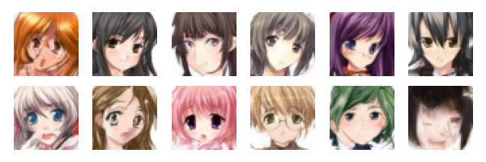

# Diffusion From Scratch To Generate Cute Anime Faces

This project implements a diffusion model from scratch for image generation using PyTorch. The model is trained to generate anime-style images.



## Project Structure

- `config.py`: Contains the configuration settings for the model.
- `data.py`: Handles the dataset loading and preprocessing.
- `model.py`: Defines the architecture of the diffusion model and its components.
- `train.py`: Contains the training loop for the model.
- `inference.py`: Handles the image generation process using the trained model.
- `main.py`: Entry point for training and inference.
- `requirements.txt`: Lists the dependencies required for the project.
- `.gitignore`: Specifies files and directories to be ignored by Git.

## Requirements
Install the required packages using:

```bash
pip install -r requirements.txt
```

## Configuration

The configuration settings are defined in `config.py`. You can modify the settings as needed.

```python
class CONFIG:
    model_path = 'ddpm_unet_1000.pth'
    num_epochs = 50
    lr = 1e-4
    num_timesteps = 1000
    batch_size = 32
    img_size = 48
    in_channels = 3
    num_img_to_generate = 12
```

## Training

To train the model, run:

```bash
python main.py train
```

This will start the training process using the settings defined in `config.py`.

## Inference

To generate images using the trained model, run:

```bash
python main.py inference
```

This will generate and display random images using the trained model.

## Dataset

The dataset should be placed in the `./data/anime` directory. The `AnimeDataset` class in `data.py` handles the loading and preprocessing of the images.

## Model Architecture

The model architecture is defined in `model.py`. It includes the following components:

- `DiffusionForwardProcess`: Implements the forward process of the diffusion model.
- `DiffusionReverseProcess`: Implements the reverse process of the diffusion model.
- `Unet`: Defines the U-Net architecture used for the model.

## License

This project is licensed under the MIT License.

## Acknowledgements

This project was created using the following resources:
- [DDPM FROM SCRATCH](https://www.kaggle.com/code/vikramsandu/ddpm-from-scratch-in-pytorch)
